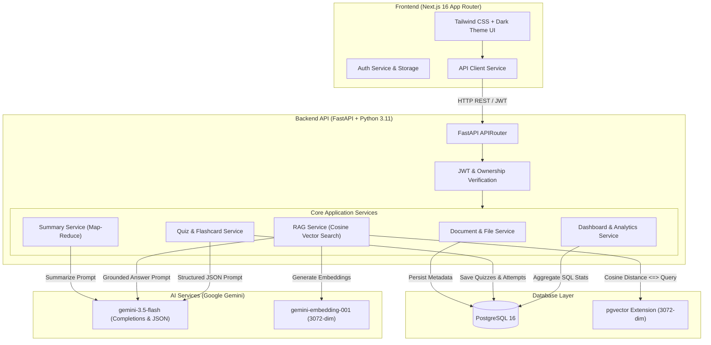

# 📚 AI Study Assistant

> A production-grade, full-stack AI study platform built with **FastAPI**, **Next.js**, **PostgreSQL + pgvector**, and **Google Gemini AI**.
> Upload lecture PDFs, generate map-reduce summaries, perform page-aware RAG vector searches, practice grounded multiple-choice quizzes, study interactive flashcards, and track your study analytics.

---

## 🌟 Key Features

- 🔐 **Authentication & Security**: JWT-based authentication with bcrypt password hashing (72-byte limit enforced) and strict multi-tenant ownership isolation.
- 📄 **PDF Upload & Text Extraction**: Validation of PDF magic bytes (`%PDF-1.`), file size checks, and page-boundary preserved text extraction (`--- Page N ---`).
- ⚡ **AI Document Summarization**: Automated map-reduce summarization with Gemini 3.5 Flash for large documents (>12,000 characters), outputting executive overviews, key takeaways, and key terminology.
- 🔍 **RAG Document Q&A with Citations**: Page-aware document chunking (400 words, 80-word overlap), 3072-dimensional Gemini embeddings stored in PostgreSQL `pgvector`, cosine similarity search (`<=>`), grounding threshold safeguard (0.85 cutoff), and page-level citations.
- 📝 **AI Quiz Generation & Server-Side Scoring**: Grounded multiple-choice question generation with 4 options, explanations, and page citations. Server-side answer validation prevents client tampering and updates progress analytics.
- 🎴 **Interactive 3D Flashcards**: Instant study card set generation with front/back flip animations, shuffle controls, and page citations.
- 📊 **SaaS Student Dashboard**: Real-time study statistics (Documents, AI Chats, Quizzes Completed, Average Score %, Flashcards) and dynamic activity timeline synthesis.

---

## 🏗️ Architecture Diagram



---

## 🧠 RAG Pipeline Technical Deep-Dive

```
PDF Document → Text Extraction (with Page Markers) → Page-Aware Chunking → 3072-dim Embeddings → pgvector Indexing → Cosine Retrieval (<=>) → Gemini Answer Generation → Page Citations
```

| Pipeline Stage | Implementation & Design Rationale |
|---|---|
| **Text Extraction** | `pypdf` extracts raw text and inserts explicit page boundary markers (`--- Page N ---`). |
| **Chunking Strategy** | Custom chunker creates chunks of ~400 words with 80-word overlap while preserving the original page metadata for each chunk. |
| **Embedding Generation** | `gemini-embedding-001` generates 3072-dimensional dense vector representations. |
| **Vector Storage** | PostgreSQL with `pgvector` extension storing `Vector(3072)` columns on the `document_chunks` table. |
| **Semantic Retrieval** | Native SQL cosine distance query (`embedding <=> query_vector`) returning top 4 matching chunks (`top-k = 4`). |
| **Grounding Safeguard** | Threshold cutoff `MAX_COSINE_DISTANCE_THRESHOLD = 0.85`. If similarity distance exceeds 0.85, system triggers an ungrounded fallback warning to prevent hallucinated answers. |
| **Source Citations** | Chat responses extract `page_number` metadata and preview excerpts (capped at 250 characters) to provide transparent citations. |

---

## 🛠️ Technology Stack

- **Frontend**: Next.js 16 (App Router), TypeScript, React 19, Tailwind CSS, Lucide Icons.
- **Backend**: FastAPI, Python 3.11+, SQLAlchemy 2.0 (Async-compatible), Alembic, Pydantic V2.
- **Database**: PostgreSQL 16 with `pgvector` extension.
- **AI Infrastructure**: Google Gemini API (`gemini-3.5-flash` completion model, `gemini-embedding-001` vector embeddings).
- **Testing & Quality**: `pytest` (40 backend tests), ESLint, TypeScript `tsc`, Next.js build compiler.
- **DevOps**: Docker, Docker Compose, GitHub Actions CI.

---

## 📊 Database Entity Relationship Schema

```
Users (id, email, password_hash, full_name, created_at)
  ├── Documents (id, user_id, title, storage_path, file_size, page_count, processing_status)
  │     ├── DocumentChunks (id, document_id, content, page_number, embedding [Vector(3072)])
  │     ├── Summaries (id, document_id, overview, key_points, important_terms, conclusion)
  │     ├── Chats (id, user_id, document_id, title)
  │     │     └── Messages (id, chat_id, role, content, source_reference)
  │     ├── Quizzes (id, user_id, document_id, title, difficulty)
  │     │     ├── Questions (id, quiz_id, prompt, options [JSON], correct_answer, explanation, source_page)
  │     │     └── QuizAttempts (id, user_id, quiz_id, score, total_questions, percentage)
  │     └── Flashcards (id, user_id, document_id, front, back, source_page)
  └── StudyProgress (id, user_id, document_id, completion_percent)
```

---

## 🚀 Quickstart & Local Setup

### Prerequisites
- Python 3.11+
- Node.js 20+
- Docker & Docker Compose (for PostgreSQL + pgvector)
- Google Gemini API Key

### 1. Clone & Environment Configuration

```bash
git clone https://github.com/hoangdat233/AI-Study-Assistant.git
cd AI-Study-Assistant
cp .env.example .env
```

Edit `.env` and set your `LLM_API_KEY`:
```env
LLM_API_KEY=your_actual_gemini_api_key
```

### 2. Start Database with Docker Compose

```bash
docker compose up db -d
```
*(Starts PostgreSQL + pgvector on host port `5433`)*

### 3. Backend Setup & Database Migrations

```bash
cd backend
python -m venv .venv
# Windows: .venv\Scripts\activate
# Linux/macOS: source .venv/bin/activate
pip install -e .[dev]

# Run Alembic migrations
alembic upgrade head

# Start FastAPI development server
uvicorn app.main:app --reload --port 8000
```

### 4. Frontend Setup

```bash
cd ../frontend
npm install
npm run dev
```

Open [http://localhost:3000](http://localhost:3000) in your browser.

---

## 🧪 Testing & Verification

### Run Backend Pytest Suite

```bash
cd backend
pytest -v
```
*(40 passing tests covering Auth, Uploads, Summarization, RAG Retrieval, Quizzes, Flashcards, and Dashboard Analytics)*

### Run Frontend Typecheck, Lint & Production Build

```bash
cd frontend
npm run lint
npx tsc --noEmit
npm run build
```

---

## 💡 Key Engineering Challenges & Solutions

1. **Structured LLM Output Validation**:
   - *Challenge*: LLM providers often output markdown codeblocks or unformatted JSON strings when generating quizzes or summaries.
   - *Solution*: Passed `response_mime_type="application/json"` to Gemini API and wrapped parser calls with Pydantic V2 schema validation (`QuizGenerationSchema`), automatically enforcing rigid options arrays, correct answers, and explanations.

2. **Large Document Summarization Context Limits**:
   - *Challenge*: Textbook chapters exceed single-prompt token budgets and cause context dilution.
   - *Solution*: Designed a Map-Reduce summary pipeline (`SummaryService`). Documents exceeding 12,000 characters are chunked, summarized in parallel (Map step), and combined into a final executive study guide (Reduce step).

3. **Page-Aware Citation Retrieval**:
   - *Challenge*: Standard RAG implementations retrieve text chunks without knowing which PDF page the answer originated from.
   - *Solution*: Built a custom `DocumentChunker` that inspects `--- Page N ---` section headers during chunking and attaches explicit `page_number` metadata to every 3072-dimensional vector chunk in PostgreSQL `pgvector`.

---

## 🎓 Technical Interview Q&A Reference

- **Q: Why did you choose FastAPI for the backend?**
  - *A*: FastAPI provides high performance (built on Starlette/uvicorn), automatic OpenAPI documentation, native async support, and tight integration with Pydantic V2 for strict request/response data validation.

- **Q: How does pgvector compare to dedicated vector databases like Pinecone?**
  - *A*: `pgvector` allows vector embeddings to live inside our primary PostgreSQL database. This eliminates dual-database synchronization complexity, enables ACID transactional guarantees, simplifies user data isolation via SQL joins, and reduces deployment operational cost.

- **Q: How do you prevent LLM hallucinations during document Q&A?**
  - *A*: We enforce strict grounding. The system prompt restricts Gemini to answer *only* using provided context snippets. Furthermore, we calculate cosine distance (`<=>`) on retrieved vector chunks and enforce a `0.85` similarity distance threshold cutoff. If chunks exceed this distance, the system returns a clear ungrounded notice instead of generating speculative answers.

- **Q: Why perform quiz grading on the server side?**
  - *A*: Client-side grading can be inspected or manipulated via browser developer tools. Server-side grading in `DashboardService` compares student answers directly against stored database answers, calculates exact percentages, and persists tamper-proof attempt records for analytics.

---

## 📜 License

This project is open-source under the MIT License.
